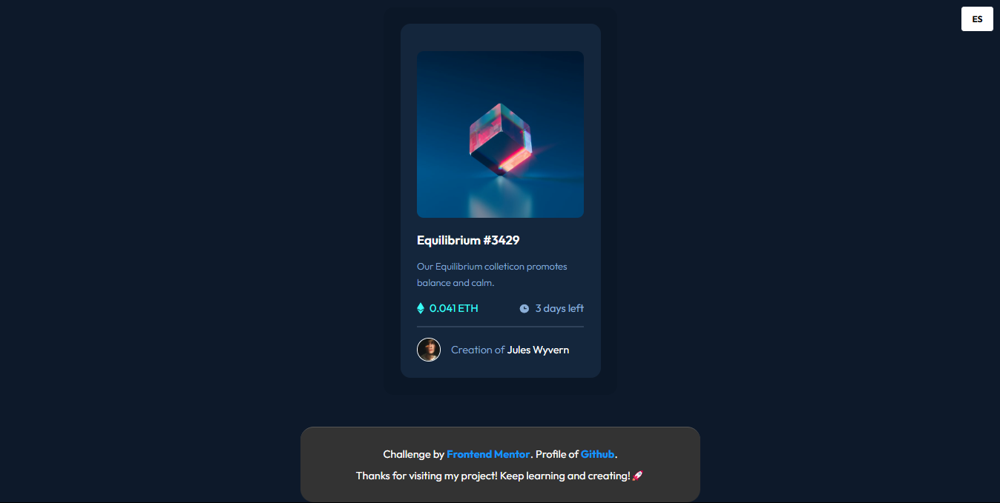
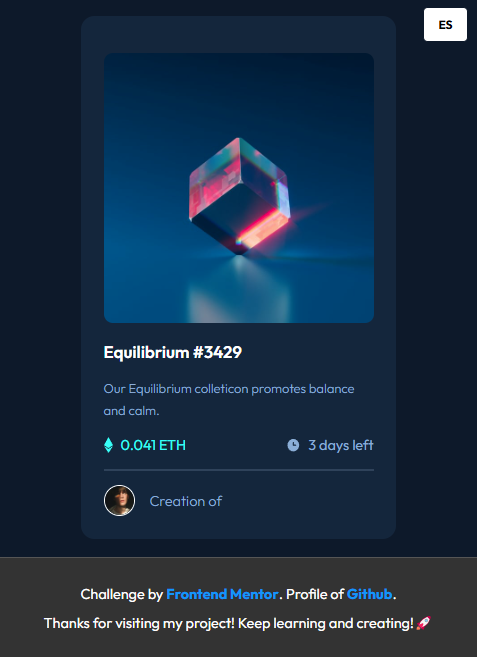

# Results NFT preview card component



# 📝 Descripción

> Este proyecto es un componente de un NFT que muestra información sobre su precio, su creador y el tiempo restante, de manera interactiva y visualmente atractiva. Está diseñado para ser completamente responsive, con diseños adaptados tanto para móviles como para escritorio. Además, utiliza un diseño CSS flexbox moderno y eficiente para su visualización.

## ✨ Características principales

- **Diseño responsive:** Compatible con móviles y escritorio.

- **Cambio de idioma:** Incluye un botón para cambiar entre español e inglés.

- **Carga Dinamica del Contenido:** Incluye tres archivos .JSON para la carga de los datos del NFT y la carga de los idiomas

- **Diseño Flexbox:** Optimizado para una visualización perfecta en desktop y mobile.

- **Visualización de resultados:** Fondos con colores modernos y atractivos.

- **Desglose por categorías:** Muestra resultados detallados por cada categoría.

## 🛠️ Tecnologías utilizadas

- **_HTML:_** Estructura semántica del componente.

- **_CSS:_** Estilos avanzados con Flexbox.

- **JavaScript:** Funcionalidad de cambio de idioma y carda Dinamica del contenido.

- **JSON:** Almacenamiento de los datos del NFT y los idiomas.

- **_Google Fonts:_** Fuente _Outfit_ para un diseño moderno.

## 🌐 Cambio de idioma

> El proyecto incluye un botón para cambiar entre español e inglés. Esta funcionalidad se implementó utilizando:

- Dos archivos JSON: es.json (para español) y en.json (para inglés).

- JavaScript: Para cargar dinámicamente los textos según el idioma seleccionado.

### ¿Cómo funciona?

> Al hacer clic en el botón de cambio de idioma, el contenido del componente se actualiza automáticamente.

> Los textos se cargan desde los archivos JSON correspondientes (es.json para español y en.json para inglés).

## 🚀 Instalación

Sigue estos sencillos pasos para ejecutar el proyecto en tu entorno local:

1. **Clona este repositorio**:
   Abre tu terminal y ejecuta el siguiente comando:

   ```bash
   git clone https://github.com/ImBenja/nft-preview-component.git

   ```

2. **Navega al directorio del proyecto**:

   ```bash
   cd nft-preview-component

   ```

3. **Abre el archivo index.html en tu navegador**:
   Puedes hacerlo doble clic en el archivo o arrastrarlo a tu navegador.

## 💻 Uso

El componente funciona de la siguiente manera:

1. Carga automáticamente el contenido dinamicamente.

2. Muestra la informacion del NFT en una tarjeta.

3. Se adapta automáticamente a diferentes tamaños de pantalla.

4. Presiona el botón de cambio de idioma para alternar entre español e inglés. Los textos se cargan dinámicamente desde los archivos _es.json_ y _en.json_.

## 🔗 Demo en vivo

Puedes ver una demostración en vivo del proyecto **<a href="https://challengebentogrid.netlify.app/">Aqui</a>**

<table border="1">
  <tr>
    <th>
      Mobile View
    </th>
  </tr>
  <tr>
    <td>
      
    </td>
  </tr>
  <tr>
     <th>
      Desktop View
    </th>
  </tr>
  <tr>
     <td>
      
    </td>
  </tr>
</table>

## 👨‍💻 Autor

- **_Benjamin Juarez_**

<a href= "https://www.instagram.com/benjajuarez1_/?hl=es">
    
</a>
<a href="https://www.frontendmentor.io/profile/ImBenja">
  
</a>
